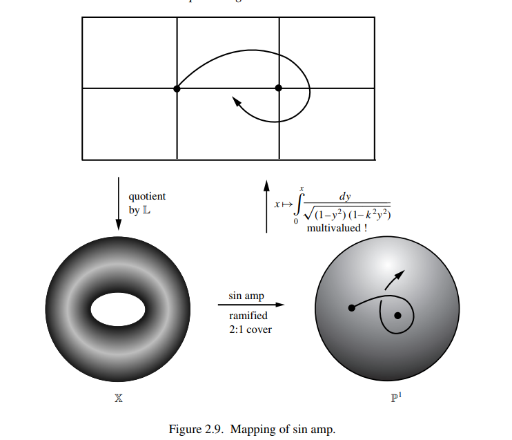

## 初等函数

整理一些关于共形映射的算例

1. sinz

将区域

$$
A=\{|Re(z)|<\frac{\pi}{2}\}
$$

映到上半平面

2. arcsinz

将区域

$$
A=\{|Im(z)|<\frac{\pi}{2},Re(z)>0\}
$$

映到上半平面

3. 分式线性变换
   $$
       F(z)=\frac{i-z}{z+i}:H\to D\\
       G(z)=i\frac{z-1}{z+1}: D\to H
   $$
4. logz
   $$
    H\to \{z|0<Imz<\pi\}
   $$
5. $ z^{\alpha} $
   上半平面到扇形

## Schwarz Lemma

if a holomorphic function $ f:D\to D $ satisfies |f(0)|=0, then

1. |f(z)|<|z|
2. for some $ z_0 $, $ f(z_0)=z_0 $, then f is rotation
3. |f^{'}(0)| ≤ 1, and if equality holds, then f is a rotation

## Riemann Mapping Theorem

Suppose $ \Omega $ is proper and simply connected. If $ z_0\in \Omega $, then there exists a unique comformal map $ F:\Omega\to D $ such that

$$
    F(z_0)=0\quad and \quad F^{\prime}(z_0)>0
$$

### Proof

#### step 1. 任意单连通区域可以共形等价到包含原点的单位圆的子集

$$
    f=log(z-\alpha)\Longrightarrow e^{f}=z-\alpha
$$

选定$ \omega\in \Omega $ 且

$$
    f(z)\neq f(\omega)+2\pi i\quad \forall z\in\Omega
$$

则有$ f(z)=f(\omega) $
定理设 $ a_1<a_2 <a_3 $ 为实数，$ \omega_1，\omega_2，\omega_3 $ 为多角形域 $P$ 上按顺序排列的某三个顶点。则存在唯一的函数 $ f $ ，把 $ \mathbb{H} $ 双全纯地映射到 $ P $ ，把实轴一一连续地映射为 $ \partial P $ ，且

$$
f(a_k)=w_k(k=1,2,3)
$$

要将单位圆映到多边形，需要 Schwarz Christoffel Integral,形式如下

$$
F(\zeta)=C\int_0^\zeta\prod\limits_{k=1}^n\left(\omega-\omega_k\right)^{-\beta_k}d\omega+C'
$$

$\beta_k=1-\alpha_k$,对应内角为 $\alpha_k\pi$

定理：存在从上半平面到多边形的映射，将实轴上的点$A_1,A_2\cdots,A_k$ 映到多边形的顶点$\alpha_1,\alpha_2,\cdots,\alpha_k$ 映射为

$$
F(\zeta)=C\int_0^\zeta\prod\limits_{k=1}^n\frac{d\zeta}{\left(\zeta-A_k\right)^{\beta_k}}+C'
$$

由此，映射并不是唯一的。

如果考虑将上半平面映成长方形，即考虑 Jacobi First Kind Elliptic Function, 可以证明其结果最终是椭圆曲线。

从拓扑的意义上，$f(z)$ 在环面 $\mathbb{X}=\mathbb{C}/ \mathbb{L}$ 上是双周期的有理函数，即 $\mathbb{X}$ 是 $\mathbb{P}^1$ 的分歧覆盖(ramified cover)

进一步考虑这个问题。我们换一种记号，考虑环面上的积分，令$\mathbf{y}=\sqrt{(1-\mathbf{x})(1-k^2\mathbf{x}^2)}$ 视为环面上的单值函数，固定环面上的原点 $\mathfrak{o}=\left(\mathbf{x}=\mathfrak{o},\mathbf{y}=+1\right)\in\mathbb{X}$ ，令 $\mathfrak{p}=(\mathbf{x},\mathbf{y})$ 为环面上的一点，积分 $z=\int_o^p\mathbf{y}^{-1}d\mathbf{x}$ 依赖于从 $\mathfrak{o}$ 到$\mathfrak{p}$ 的路径，对于同一形变类（deformation class）里的路径，积分值相同。这里的术语**形变类**可以简单的认为是经过小扰动保持不变的两个物体。沿不同的形变类中的路径有不同的值，随如下的周期变化

$$
4Kn_1+2\sqrt{-1}K'n_2
$$

$4K$, 和 $2\sqrt{-1}K^{\prime}$ 都是 $\mathbf{y}^{-1}d\mathbf{x}$ 绕环面上的洞的积分。 可以认为 $z$ 是 $\mathbb{X}$ 的万有覆盖 $\mathbb{C}$ 上的单值函数。$z$ 扫过这整个万有覆盖，我们有两个投影映射

$$
\pi:\mathfrak{p}\longrightarrow \mathbf{x}
$$

和

$$
\pi_2:\mathbf{x}\longrightarrow z
$$

简单来说，如下图

